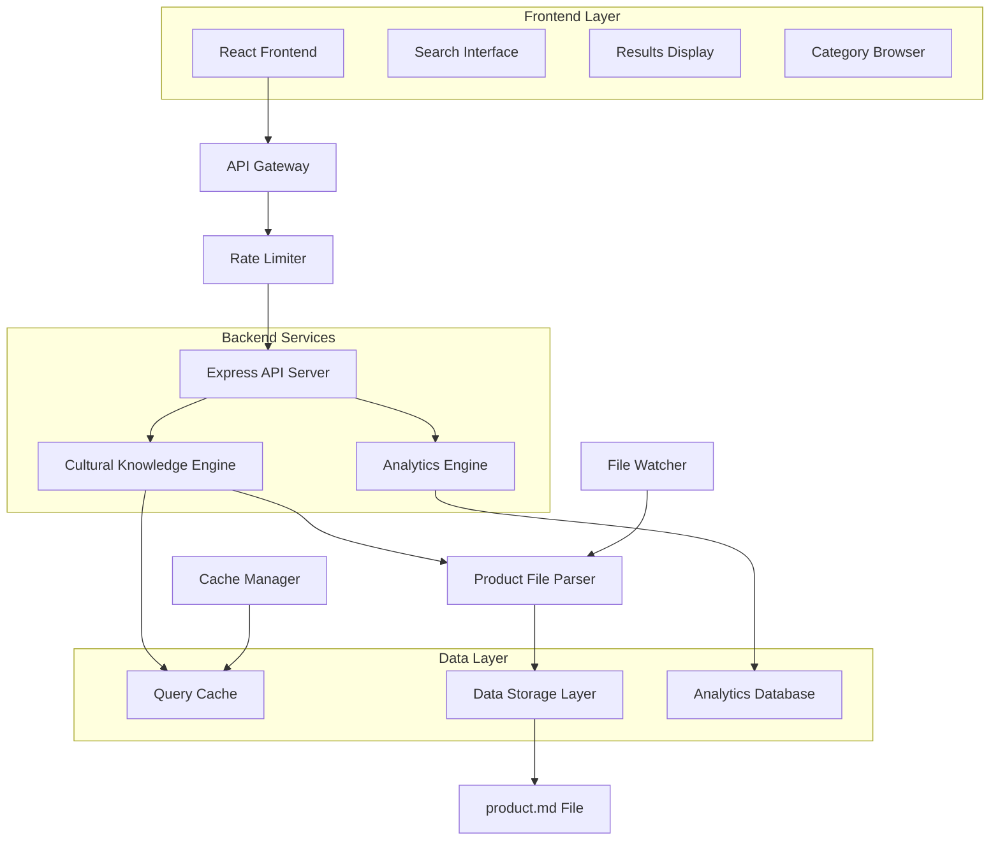

# Design Document: Meerut Culture Guide

## Overview

The Meerut Culture Guide is a web-based cultural knowledge application built with a React frontend and Node.js/Express backend. The system processes a structured product.md file containing cultural information and responds to user queries through an intuitive web interface. The application includes performance optimizations through intelligent caching, rate limiting for security, and analytics for continuous improvement.

The tool serves as a cultural bridge, helping users understand Meerut's unique blend of ancient traditions and modern development, from its historical significance in the 1857 Indian Rebellion to its contemporary status as India's sports goods capital.

## Architecture

The system follows a modern web application architecture with clear separation between frontend, backend, and data layers:



## Components and Interfaces

### 1. React Frontend Components
**Purpose**: User interface for cultural exploration and query interaction
**Key Components**:
```typescript
interface SearchInterface {
  onQuerySubmit(query: string): void
  onCategorySelect(category: string): void
  isLoading: boolean
}

interface ResultsDisplay {
  insight: CulturalInsight | null
  onRelatedTopicClick(topic: string): void
}

interface CategoryBrowser {
  categories: CulturalCategory[]
  onCategoryClick(category: string): void
}
```

### 2. API Server (Express)
**Purpose**: RESTful API for handling cultural queries and data management
**Interface**:
```typescript
interface CulturalAPI {
  POST /api/query: (query: CulturalQueryRequest) => CulturalInsight
  GET /api/categories: () => CulturalCategory[]
  GET /api/topics/:category: (category: string) => CulturalTopic[]
  GET /api/analytics: () => AnalyticsReport
}
```

### 3. Cultural Knowledge Engine
**Purpose**: Core processing engine for cultural queries and insights
**Interface**:
```typescript
interface CulturalKnowledgeEngine {
  processQuery(query: string): Promise<CulturalInsight>
  searchCulturalTopics(keywords: string[]): CulturalTopic[]
  generateInsight(topic: CulturalTopic, context: QueryContext): CulturalInsight
  getCachedResult(queryHash: string): CulturalInsight | null
}
```

### 4. Query Cache Manager
**Purpose**: Intelligent caching for frequently accessed cultural information
**Interface**:
```typescript
interface QueryCacheManager {
  get(key: string): Promise<CulturalInsight | null>
  set(key: string, value: CulturalInsight, ttl?: number): Promise<void>
  invalidate(pattern: string): Promise<void>
  getStats(): CacheStatistics
}
```

### 5. Rate Limiter
**Purpose**: Controls request frequency to prevent abuse
**Interface**:
```typescript
interface RateLimiter {
  checkLimit(identifier: string): Promise<RateLimitResult>
  incrementCounter(identifier: string): Promise<void>
  getRemainingRequests(identifier: string): Promise<number>
}
```

### 6. Analytics Engine
**Purpose**: Tracks usage patterns and popular cultural topics
**Interface**:
```typescript
interface AnalyticsEngine {
  recordQuery(query: string, category: string, responseTime: number): Promise<void>
  getPopularTopics(timeframe: string): Promise<PopularTopic[]>
  getQueryPatterns(): Promise<QueryPattern[]>
  generateReport(startDate: Date, endDate: Date): Promise<AnalyticsReport>
}
```

## Data Models

### CulturalKnowledge
```typescript
interface CulturalKnowledge {
  festivals: Festival[]
  traditions: Tradition[]
  industries: Industry[]
  historicalContext: HistoricalEvent[]
  localCustoms: LocalCustom[]
  foodCulture: FoodItem[]
  religiousHarmony: ReligiousAspect[]
  lastUpdated: Date
}
```

### CulturalQueryRequest
```typescript
interface CulturalQueryRequest {
  query: string
  category?: string
  userId?: string
  sessionId: string
}
```

### CulturalInsight
```typescript
interface CulturalInsight {
  topic: string
  mainContent: string
  historicalContext: string
  localNuances: string[]
  practicalGuidance: string
  relatedTopics: string[]
  sources: string[]
  cached: boolean
  responseTime: number
}
```

### CacheStatistics
```typescript
interface CacheStatistics {
  hitRate: number
  totalRequests: number
  cacheSize: number
  averageResponseTime: number
}
```

### RateLimitResult
```typescript
interface RateLimitResult {
  allowed: boolean
  remainingRequests: number
  resetTime: Date
  retryAfter?: number
}
```

### AnalyticsReport
```typescript
interface AnalyticsReport {
  popularTopics: PopularTopic[]
  queryPatterns: QueryPattern[]
  userEngagement: EngagementMetrics
  performanceMetrics: PerformanceMetrics
  timeframe: { start: Date; end: Date }
}
```

### PopularTopic
```typescript
interface PopularTopic {
  topic: string
  category: string
  queryCount: number
  averageResponseTime: number
  userSatisfaction?: number
}
```

### Product.md Structure
The product.md file should follow this structure:
```markdown
# Meerut Cultural Guide

## Historical Context
- Ancient connections to Indus Valley Civilization
- Vedic period and Kuru kingdom
- 1857 Indian Rebellion significance
- Buddhist heritage under Ashoka

## Festivals and Celebrations
### Nauchandi Mela
- Origin: 1672 (some sources say 1034 AD)
- Duration: Month-long after Holi
- Significance: Hindu-Muslim unity symbol
- Features: Shopping, food, cultural activities

## Industries and Crafts
### Sports Goods Manufacturing
- 35,200+ manufacturing units
- 315,000+ employed persons
- Global recognition for athletics equipment
- Traditional craftsmanship meets modern technology

### Brass Instruments
- Started in 1885 by Nadir Ali
- 95% of India's brass instruments
- Jali Kothi area specialization
- International exports

## Food Culture
### Traditional Sweets
- Gazak: Sesame and jaggery confection
- Revri: Traditional winter sweet
- Halwa Paratha: Nauchandi fair specialty

## Religious Harmony
- Coexistence of temples, mosques, gurudwaras
- Nauchandi fair as unity symbol
- Chandi Devi temple and Bale Miyan Mazaar proximity

## Local Customs and Social Practices
- Community festival participation
- Traditional craftsmanship preservation
- Modern-traditional lifestyle balance
```

## Correctness Properties

*A property is a characteristic or behavior that should hold true across all valid executions of a system-essentially, a formal statement about what the system should do. Properties serve as the bridge between human-readable specifications and machine-verifiable correctness guarantees.*

### Property 1: File Loading and Validation
*For any* valid product.md file, when the system starts, it should successfully load, parse, and validate the file structure, storing the cultural knowledge in the expected data format.
**Validates: Requirements 1.1, 1.4**

### Property 2: File Change Detection and Reloading
*For any* modification to the product.md file, the system should detect the change and reload the cultural knowledge, ensuring the updated content is available for queries.
**Validates: Requirements 1.2**

### Property 3: Error Handling for Invalid Files
*For any* missing, corrupted, or structurally invalid product.md file, the system should return specific, descriptive error messages that clearly indicate the nature of the problem.
**Validates: Requirements 1.3, 5.4**

### Property 4: Query Processing and Matching
*For any* cultural query submitted by a user, the system should process the query, identify relevant cultural topics, and match the input against the cultural knowledge from the product file.
**Validates: Requirements 2.1, 2.2**

### Property 5: Natural Language Query Handling
*For any* natural language query about Meerut culture, the system should successfully parse and process the query regardless of phrasing variations or linguistic complexity.
**Validates: Requirements 2.3**

### Property 6: Multi-Aspect Query Response
*For any* query containing multiple cultural aspects, the system should address each distinct aspect in its response, ensuring comprehensive coverage of the user's request.
**Validates: Requirements 2.4**

### Property 7: Historical Context Inclusion
*For any* cultural insight generated, the response should include relevant historical context from the product file when such context exists for the queried topic.
**Validates: Requirements 3.1**

### Property 8: Local Nuance Highlighting
*For any* cultural response, the system should highlight important local nuances specific to Meerut when such information is available in the product file.
**Validates: Requirements 3.2**

### Property 9: Practical Guidance Provision
*For any* cultural insight provided, the response should include practical guidance for cultural interactions when such guidance can be derived from the available cultural knowledge.
**Validates: Requirements 3.3**

### Property 10: Comprehensive Search Functionality
*For any* keyword-based search across cultural content, the system should return relevant sections from the product file and support searches across all cultural categories.
**Validates: Requirements 4.1, 4.2**

### Property 11: Search Result Relevance Ranking
*For any* search query that returns multiple results, the system should rank the results by relevance, with the most pertinent cultural information appearing first.
**Validates: Requirements 4.3**

### Property 12: Search Fallback Suggestions
*For any* search query that yields no relevant results, the system should suggest related cultural topics that exist in the product file.
**Validates: Requirements 4.4**

### Property 13: Product File Structure Validation
*For any* product.md file provided to the system, it should validate the file structure, identify and categorize cultural sections, and verify that required cultural categories are present.
**Validates: Requirements 5.1, 5.2, 5.3**

### Property 14: Cultural Context Preservation
*For any* cultural information presented to users, the system should preserve the original context from the product file, maintaining the integrity and meaning of the cultural knowledge.
**Validates: Requirements 6.1**

### Property 15: Meerut-Specific Detail Specification
*For any* cultural practice that has regional variations, the system should specify Meerut-specific details when such information is available in the product file.
**Validates: Requirements 6.3**

### Property 16: Responsive Web Interface
*For any* viewport size (desktop, tablet, mobile), the web interface should provide a responsive design that maintains usability and readability across all device types.
**Validates: Requirements 7.1**

### Property 17: Cultural Insight Display Formatting
*For any* cultural insight returned by the system, the web interface should display it in a readable, well-formatted manner with proper typography and layout.
**Validates: Requirements 7.3**

### Property 18: Loading State Visual Feedback
*For any* request that takes time to process, the web interface should provide visual feedback to users indicating that the system is working on their request.
**Validates: Requirements 7.4**

### Property 19: Category-Based Topic Browsing
*For any* cultural category available in the system, users should be able to browse topics within that category through the web interface.
**Validates: Requirements 7.5**

### Property 20: Query Caching for Performance
*For any* frequently accessed cultural topic, the system should cache the response and retrieve it faster on subsequent requests.
**Validates: Requirements 8.1**

### Property 21: Cached Response Performance
*For any* cached cultural query, the API server should return the response within 100ms to ensure optimal user experience.
**Validates: Requirements 8.2**

### Property 22: Cache Expiration Management
*For any* cached content, the system should automatically expire it after the configured time period to ensure data freshness.
**Validates: Requirements 8.3**

### Property 23: Cache Invalidation on File Updates
*For any* update to the product.md file, the system should invalidate related cached entries to ensure users receive updated information.
**Validates: Requirements 8.4**

### Property 24: Rate Limiting Enforcement
*For any* user or IP address, the system should enforce the configured maximum number of queries per minute to prevent abuse.
**Validates: Requirements 9.1**

### Property 25: Rate Limit Error Handling
*For any* user who exceeds the rate limit, the system should return an appropriate error message with clear guidance on when they can retry.
**Validates: Requirements 9.2**

### Property 26: IP-Based Rate Limiting for Anonymous Users
*For any* anonymous user, the system should track and enforce rate limits based on their IP address.
**Validates: Requirements 9.3**

### Property 27: User-Based Rate Limiting for Authenticated Users
*For any* authenticated user, the system should track and enforce rate limits based on their user identity rather than IP address.
**Validates: Requirements 9.4**

### Property 28: Query Frequency Tracking
*For any* cultural query submitted to the system, the analytics engine should track its frequency and category for analysis.
**Validates: Requirements 10.1**

### Property 29: Popular Topic Identification
*For any* time period, the analytics engine should correctly identify the most popular cultural topics and search terms based on query frequency.
**Validates: Requirements 10.2**

### Property 30: Privacy-Preserving Analytics
*For any* analytics report generated, the system should preserve user privacy by aggregating data and not exposing individual user information.
**Validates: Requirements 10.3**

### Property 31: Query Pattern and Engagement Insights
*For any* usage data collected, the analytics engine should provide meaningful insights on query patterns and user engagement trends.
**Validates: Requirements 10.4**

## Error Handling

The system implements comprehensive error handling across all components:

### File System Errors
- **Missing product.md**: Return clear error message with file path expectations
- **Corrupted file**: Provide specific parsing error details
- **Permission issues**: Handle file access restrictions gracefully

### Query Processing Errors
- **Empty queries**: Prompt user for specific cultural topics
- **Malformed input**: Attempt to extract meaningful keywords
- **Unsupported languages**: Provide guidance on supported query formats

### Content Validation Errors
- **Missing required sections**: List specific missing cultural categories
- **Invalid structure**: Provide detailed formatting requirements
- **Inconsistent data**: Highlight conflicting information

### Search and Retrieval Errors
- **No results found**: Offer alternative search terms and popular topics
- **Ambiguous queries**: Request clarification while providing partial results
- **System overload**: Implement graceful degradation with cached responses

## Testing Strategy

The testing approach combines unit testing for specific functionality with property-based testing for comprehensive validation across all possible inputs, plus integration testing for the web application components.

### Frontend Testing Focus
- **Component rendering**: React components render correctly with various props
- **User interactions**: Click handlers, form submissions, and navigation work properly
- **Responsive design**: Interface adapts correctly to different screen sizes
- **Loading states**: Visual feedback displays appropriately during API calls
- **Error handling**: User-friendly error messages for API failures

### Backend API Testing Focus
- **Endpoint functionality**: All API routes return correct responses
- **Rate limiting**: Request limits are enforced correctly
- **Caching behavior**: Cache hits and misses work as expected
- **Analytics tracking**: Query metrics are recorded accurately
- **Error responses**: Proper HTTP status codes and error messages

### Property-Based Testing Configuration
- **Testing Framework**: Use Jest with fast-check for TypeScript/Node.js backend, React Testing Library for frontend
- **Test Iterations**: Minimum 100 iterations per property test
- **Input Generation**: Smart generators for cultural queries, file structures, API requests, and UI interactions
- **Property Validation**: Each property test references its corresponding design document property

### Integration Testing
- **End-to-end workflows**: Complete user journeys from query to response
- **API integration**: Frontend correctly consumes backend API responses
- **Cache integration**: Caching layer works correctly with API and file system
- **Analytics integration**: User actions are properly tracked and reported

### Performance Testing
- **Response times**: API endpoints meet performance requirements
- **Cache effectiveness**: Cache hit rates and performance improvements
- **Rate limiting**: System handles high request volumes gracefully
- **Concurrent users**: Application performs well under load

### Test Tagging Format
Each property-based test must include a comment with the following format:
```
// Feature: meerut-culture-guide, Property 1: File Loading and Validation
```

### Dual Testing Benefits
- **Unit tests** catch specific bugs and validate concrete examples
- **Property tests** verify universal correctness across all possible inputs
- **Integration tests** ensure components work together correctly
- **Combined coverage** ensures both specific functionality and general robustness
- **Early bug detection** through comprehensive input space exploration

The testing strategy ensures that the Meerut Culture Guide web application maintains cultural authenticity while providing reliable, fast, and secure access to cultural information.